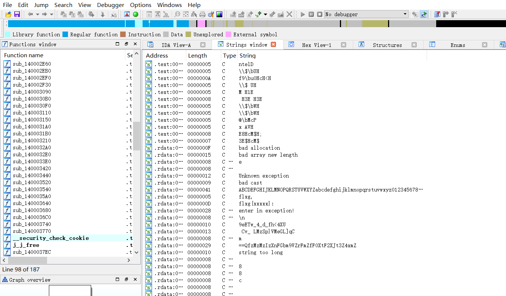
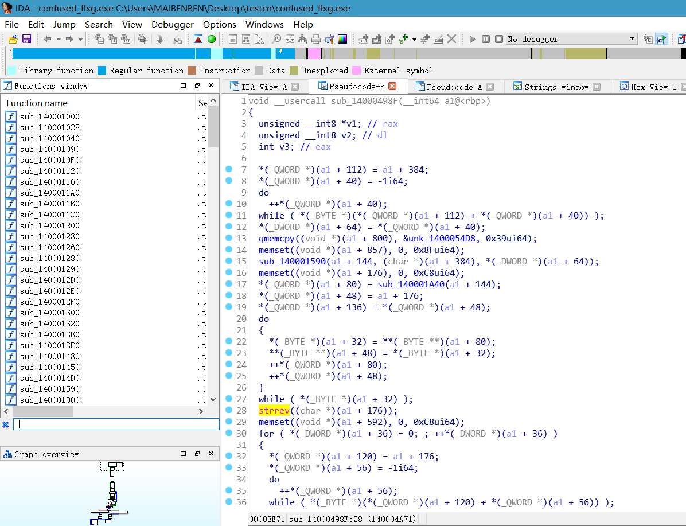

# 困惑的flxg小程序解题writeup

	我们先把程序拖入ida,等ida分析完毕后，我们先从所有字符串下手!
	
	
* 拖入ida,一般来说都先从字符串入手,有一个像是生成base64的字符串,还有一个像是逆序的base64字符串,解出来:flxg{I_am_A_fake_flag_23333},恩，好吧，那我们看看程序别的信息,我们会发现有一个进入异常的string可能这道题目和C++异常有关,看到那么多函数，瞬间有点懵，没事慢慢来，先看哪些系统函数被调用了！*

	
	我们看到如此多的函数，我们找到结尾为498F的这个函数，里面运用了strrev来翻转字符串。恩,这应该就是解密函数。
	我们来分析这个解密函数。
 1.qmemcpy((void *)(a1 + 800), &unk_1400054D8, 0x39ui64);
 > 此句将一串怪异的字符串复制到了一个内存地址。我们跟随一下这个地址里面的内容
    
	
```C
00000001400054D0  0A 00 00 00 00 00 00 00  39 65 45 54 77 5F 34 5F  ........9eETw_4_
00000001400054E0  64 5F 66 68 3C 34 58 55  7F 43 21 4B 7F 20 43 76  d_fh<4XU.C!K. Cv
00000001400054F0  5F 20 4C 4D 7A 53 70 7D  56 4D 65 47 4C 5D 71 43  _ LMzSp}VMeGL]qC
0000000140005500  18 6F 47 48 42 18 1C 4D  74 45 01 69 00 4D 5B 6D  .oGHB..MtE.i.M[m
```

2. 我们接着分析经过sub——140001590函数后将一块内存地址初始化为0

3. 我们继续分析

```C
do
  {
    *(_BYTE *)(a1 + 32) = **(_BYTE **)(a1 + 80);
    **(_BYTE **)(a1 + 48) = *(_BYTE *)(a1 + 32);
    ++*(_QWORD *)(a1 + 80);
    ++*(_QWORD *)(a1 + 48);
  }
```

这一段代码类似于strcpy()

4. 接着我们看到了调用了strrev函数，这个函数翻转了字符串的内容

5. 接着我们往下看
```C
*(_BYTE *)(a1 + *(signed int *)(a1 + 36) + 592) = *(_BYTE *)(a1 + 36) ^ *(_BYTE *)(a1+ *(signed int *)(a1 + 36) + 176);
```

这是在for循环里的xor操作，*(_BYTE *)(a1 + 36)就像我们for()中的 i 循环变量。

之后就没有什么加密的操作了

我们将我们发现的那一段字符串整理出来。


我们跟据我们的分析来写解密程序

```Python
#!/usr/bin/env python3
import base64
gotlist = "39 65 45 54 77 5F 34 5F 64 5F 66 68 3C 34 58 55 7F 43 21 4B 7F 20 43 76 5F 20 4C 4D 7A 53 70 7D 56 4D 65 47 4C 5D 71 43 18 6F 47 48 42 18 1C 4D 74 45 01 69 00 4D 5B 6D".split()
flxg = ""
ccc = 0
for i in gotlist:
    flxg = flxg + str(chr(int("0x"+i,base=16)^ccc))
    ccc = ccc + 1

print("We got xor:" + flxg)
flxg = flxg[::-1]
print("We reverse it, we get:" + flxg)
flxg = base64.b64decode(bytes(flxg,'utf-8'))
print("We will get the flag:" + str(flxg))
```

运行后我们就得到了我们的flxg

